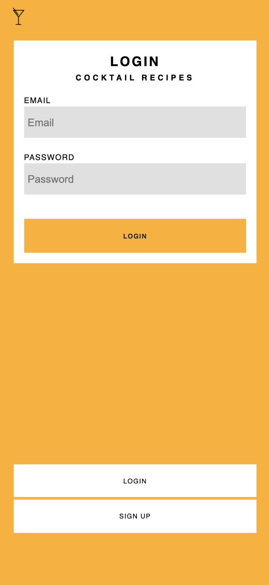

# CocktailRecipes
Cocktail Recipes is project to learn more about validation and filtering of user inputs with php.

The project uses following techniques:

php
*Regular expression match
*Prepared statements
*Hashing 
*Sessions

CSS
* CSS Grid Layout

##Desktop

##Mobile

